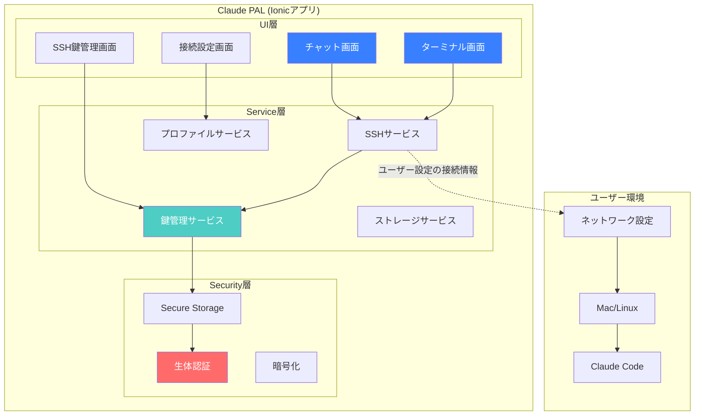
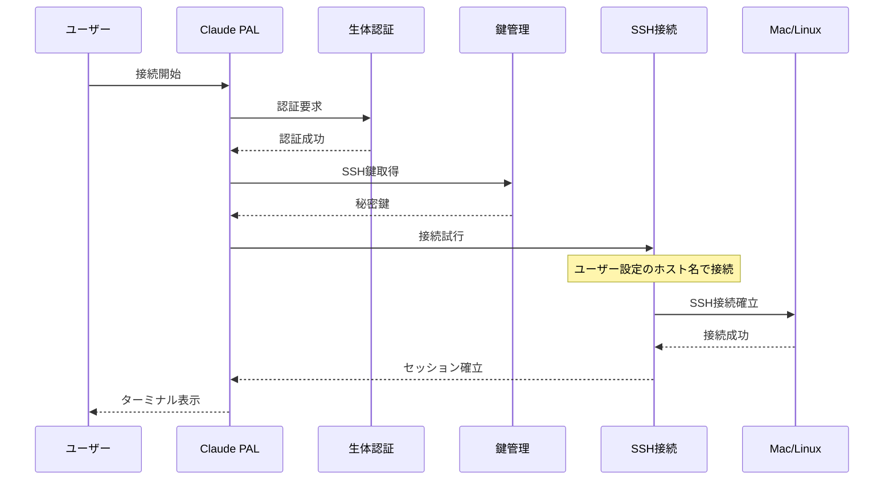
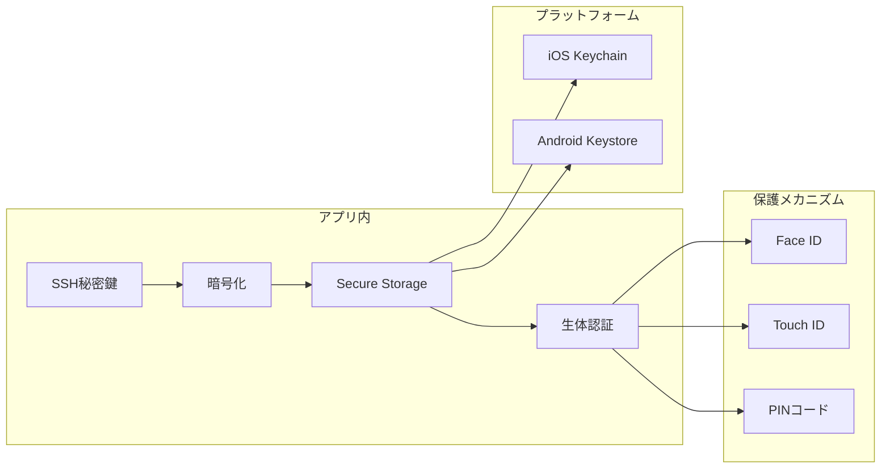

# Claude PAL アーキテクチャと技術スタック

## アーキテクチャ概要



## 技術スタック

### フロントエンド
```json
{
  "@ionic/angular": "^8.6.5",
  "@angular/core": "^20.1.3",
  "@angular/common": "^20.1.3",
  "@angular/forms": "^20.1.3",
  "@angular/router": "^20.1.3",
  "@capacitor/core": "^7.4.2",
  "@capacitor/ios": "^7.4.2",
  "@capacitor/android": "^7.4.2"
}
```

### UI/UXライブラリ
```json
{
  "xterm": "^5.4.0",
  "xterm-addon-fit": "^0.9.0",
  "xterm-addon-web-links": "^0.10.0",
  "xterm-addon-search": "^0.14.0",
  "monaco-editor": "^0.46.0",
  "@ctrl/ngx-monaco-editor": "^7.0.0"
}
```

### SSH/セキュリティ
```json
{
  "ssh2": "^1.16.0",
  "ssh2-promise": "^1.0.3",
  "node-forge": "^1.3.1",
  "crypto-js": "^4.2.0"
}
```

### Capacitorプラグイン
```json
{
  "@capacitor/preferences": "^7.0.0",
  "@capacitor/filesystem": "^7.0.0",
  "@capacitor/clipboard": "^7.0.0",
  "@capacitor/haptics": "^7.0.0",
  "@capacitor/keyboard": "^7.0.0",
  "@capacitor-community/ssh": "^1.0.0",
  "capacitor-secure-storage-plugin": "^0.9.0"
}
```

### 状態管理・ユーティリティ
```json
{
  "@ngrx/store": "^19.2.1",
  "@ngrx/effects": "^19.2.1",
  "rxjs": "^7.8.1",
  "date-fns": "^3.6.0",
  "uuid": "^10.0.0"
}
```

### 開発ツール
```json
{
  "@angular/cli": "^20.1.3",
  "@ionic/cli": "^7.2.0",
  "typescript": "^5.8.3",
  "eslint": "^9.14.0",
  "prettier": "^3.3.3",
  "husky": "^9.1.6"
}
```

## プロジェクト構造

```
claude-pal/
├── src/
│   ├── app/
│   │   ├── core/                    # コアモジュール
│   │   │   ├── services/
│   │   │   │   ├── ssh.service.ts
│   │   │   │   ├── key-manager.service.ts
│   │   │   │   ├── profile.service.ts
│   │   │   │   └── storage.service.ts
│   │   │   ├── guards/
│   │   │   │   └── auth.guard.ts
│   │   │   └── interceptors/
│   │   │       └── error.interceptor.ts
│   │   │
│   │   ├── shared/                  # 共有モジュール
│   │   │   ├── components/
│   │   │   │   ├── terminal/
│   │   │   │   ├── code-editor/
│   │   │   │   └── message/
│   │   │   ├── directives/
│   │   │   └── pipes/
│   │   │
│   │   ├── features/                # 機能モジュール
│   │   │   ├── chat/               # Claude Code対話
│   │   │   ├── terminal/           # ターミナル
│   │   │   ├── keys/               # SSH鍵管理
│   │   │   ├── connection/         # 接続設定
│   │   │   └── settings/           # 設定
│   │   │
│   │   └── app-routing.module.ts
│   │
│   ├── assets/
│   ├── environments/
│   └── theme/
│
├── capacitor.config.ts
├── ionic.config.json
├── angular.json
├── package.json
└── tsconfig.json
```

## データフロー



## セキュリティアーキテクチャ



## 主要コンポーネントの役割

### 1. SSH鍵管理サービス
- 鍵の生成（RSA 4096bit）
- 安全な保存（プラットフォーム別）
- 生体認証による保護
- 公開鍵のエクスポート

### 2. SSH接続サービス
- ssh2ライブラリを使用
- WebSocket経由の接続（必要に応じて）
- セッション管理
- エラーハンドリング

### 3. ターミナルコンポーネント
- xterm.jsによる表示
- Claude Code用の最適化
- コマンド履歴
- 検索機能

### 4. プロファイル管理
- 接続情報の保存
- 複数プロファイル対応
- 最後に使用した設定の記憶