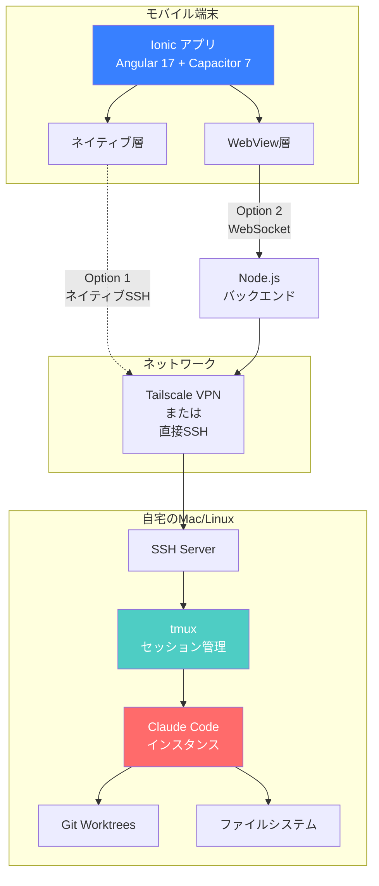
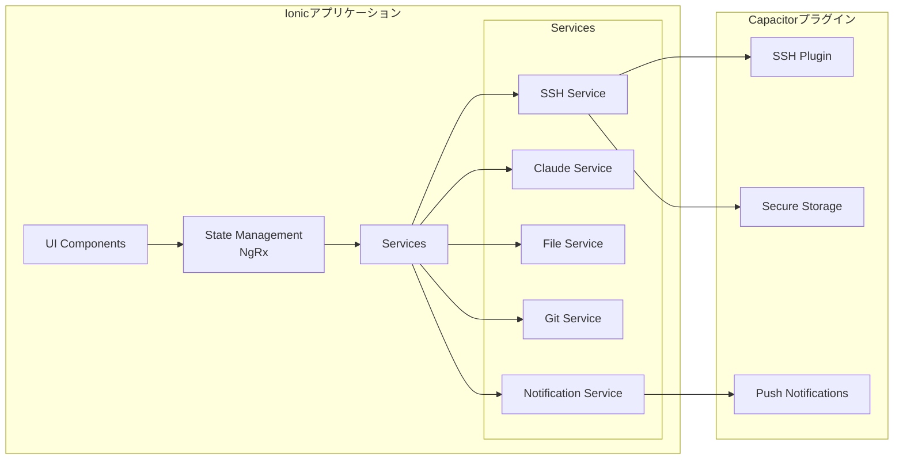
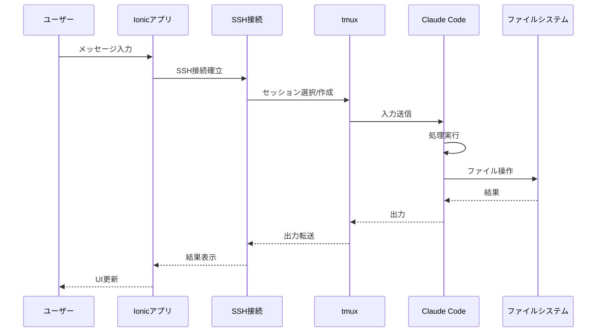
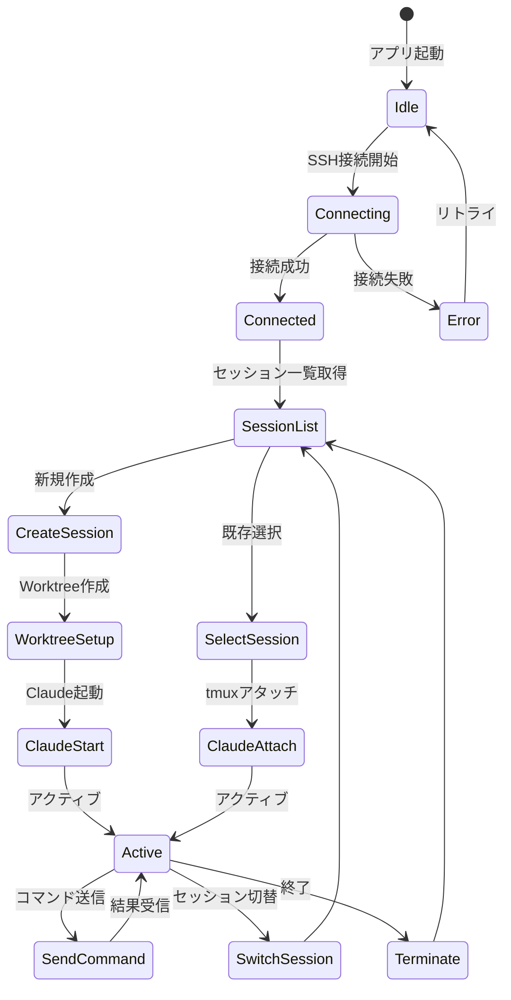
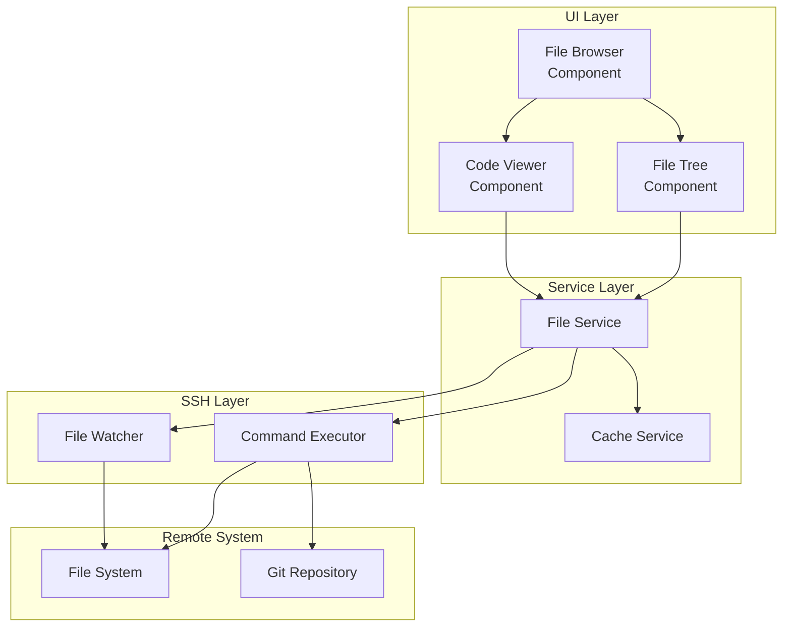
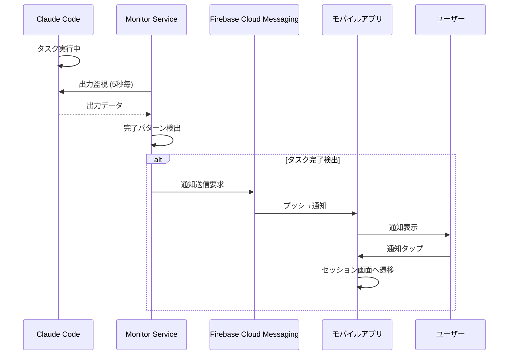
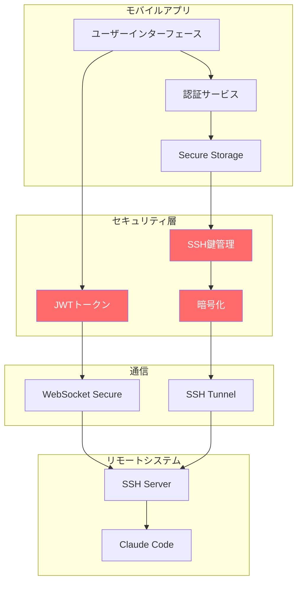
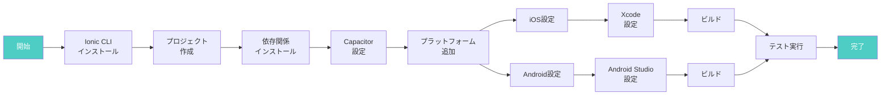
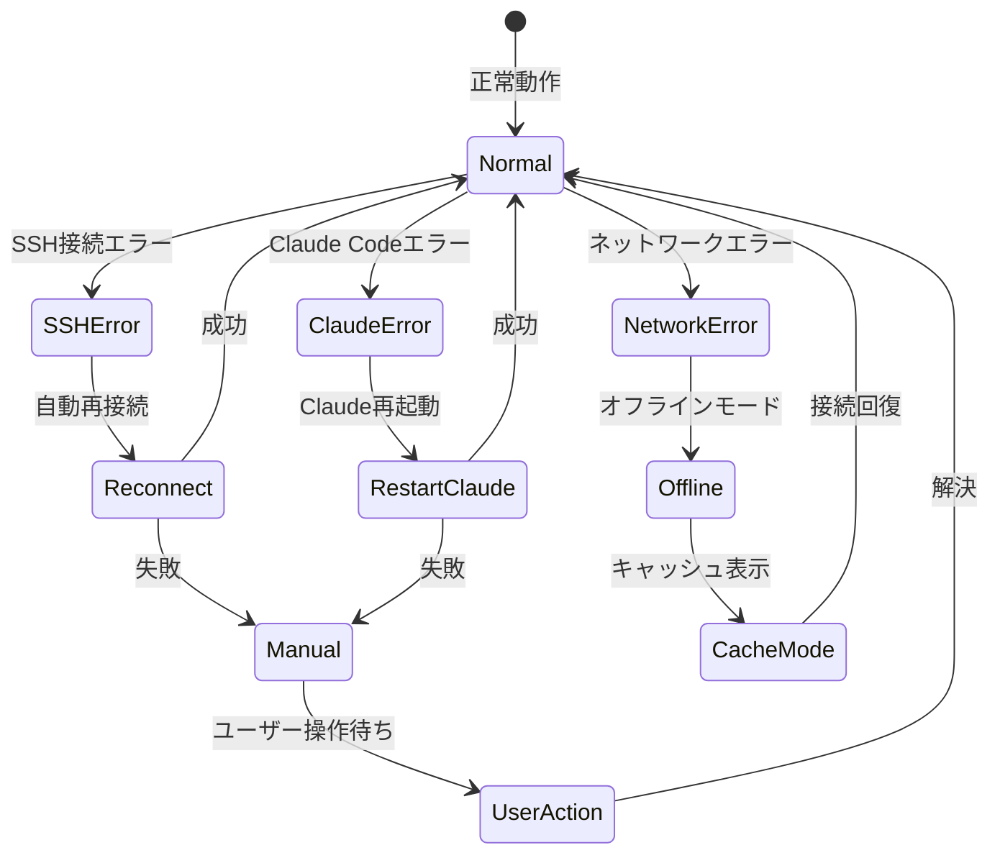
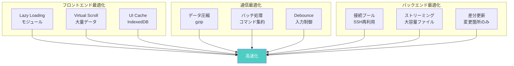

# Claude PAL アーキテクチャ図

## 1. システム全体アーキテクチャ

## 2. コンポーネント詳細アーキテクチャ

## 3. データフロー図

## 4. 複数セッション管理フロー

## 5. ファイルブラウザーアーキテクチャ

## 6. プッシュ通知フロー

## 7. セキュリティアーキテクチャ

## 8. 開発環境セットアップフロー

## 9. エラーハンドリングフロー

## 10. パフォーマンス最適化戦略

