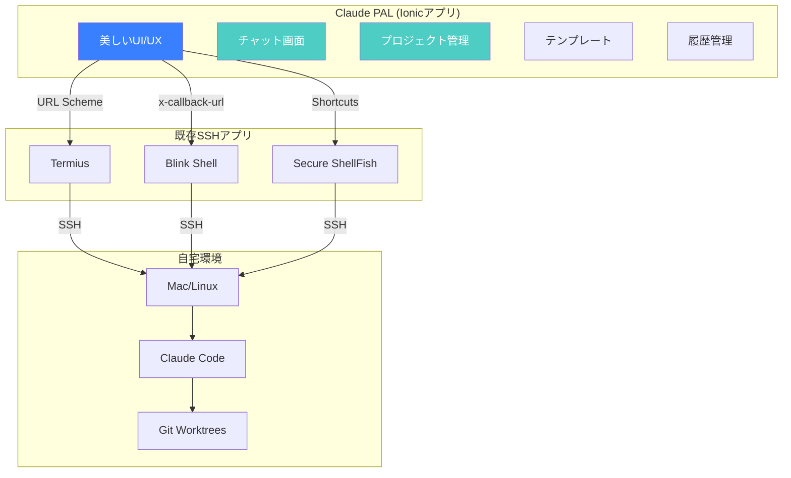

# 簡素化されたClaude PALアーキテクチャ

## コンセプト
"SSH接続は既存アプリに任せ、Claude PALは最高のClaude Code体験に集中"

## アーキテクチャ図



## 簡素化されたプロジェクト構造

```
claude-pal/
├── src/                         # Ionicアプリのみ
│   ├── app/
│   │   ├── pages/
│   │   │   ├── chat/          # Claude対話画面
│   │   │   ├── projects/      # プロジェクト管理
│   │   │   ├── templates/     # テンプレート
│   │   │   └── settings/      # 設定
│   │   ├── components/
│   │   │   ├── message/       # メッセージコンポーネント
│   │   │   ├── code-block/    # コードハイライト
│   │   │   └── input/         # スマート入力
│   │   └── services/
│   │       ├── ssh-bridge/    # SSHアプリ連携
│   │       ├── storage/       # ローカルストレージ
│   │       └── shortcuts/     # iOS Shortcuts
│   ├── assets/
│   └── theme/
├── capacitor.config.ts
├── ionic.config.json
├── package.json
└── README.md
```

## 最小限の依存関係

```json
{
  "dependencies": {
    "@ionic/angular": "^8.6.5",
    "@angular/core": "^20.1.3",
    "@capacitor/core": "^7.4.2",
    "@capacitor/app": "^7.0.0",
    "@capacitor/clipboard": "^7.0.0",
    "@capacitor/storage": "^7.0.0",
    "@capacitor/haptics": "^7.0.0",
    "rxjs": "^7.8.1"
  },
  "devDependencies": {
    "@angular/cli": "^20.1.3",
    "@ionic/cli": "^7.2.0",
    "typescript": "^5.8.3"
  }
}
```

## コア機能の実装

### 1. SSHアプリブリッジサービス
```typescript
// src/app/services/ssh-bridge/ssh-bridge.service.ts
import { Injectable } from '@angular/core';
import { App } from '@capacitor/app';
import { Clipboard } from '@capacitor/clipboard';

@Injectable({ providedIn: 'root' })
export class SSHBridgeService {
  private selectedApp: 'termius' | 'blink' | 'shellfish' = 'termius';
  
  async sendCommand(command: string): Promise<void> {
    // コマンドをクリップボードにコピー（フォールバック用）
    await Clipboard.write({ string: command });
    
    switch(this.selectedApp) {
      case 'termius':
        await this.openTermius();
        break;
      case 'blink':
        await this.openBlink(command);
        break;
      case 'shellfish':
        await this.runShortcut(command);
        break;
    }
  }
  
  private async openTermius() {
    // Termiusを開く（ユーザーが手動でペースト）
    await App.openUrl({ url: 'termius://' });
  }
  
  private async openBlink(command: string) {
    const url = `blinkshell://run?cmd=${encodeURIComponent(command)}`;
    await App.openUrl({ url });
  }
  
  private async runShortcut(command: string) {
    const url = `shortcuts://run-shortcut?name=ClaudePAL&input=${encodeURIComponent(command)}`;
    await App.openUrl({ url });
  }
}
```

### 2. チャット画面
```typescript
// src/app/pages/chat/chat.page.ts
@Component({
  selector: 'app-chat',
  template: `
    <ion-header>
      <ion-toolbar>
        <ion-title>Claude Code</ion-title>
        <ion-buttons slot="end">
          <ion-button (click)="showProjects()">
            <ion-icon name="git-branch"></ion-icon>
          </ion-button>
        </ion-buttons>
      </ion-toolbar>
    </ion-header>
    
    <ion-content>
      <div class="messages">
        <app-message 
          *ngFor="let msg of messages" 
          [message]="msg"
          [isUser]="msg.isUser">
        </app-message>
      </div>
    </ion-content>
    
    <ion-footer>
      <ion-toolbar>
        <ion-textarea
          [(ngModel)]="input"
          placeholder="Claude Codeへのメッセージ..."
          [autoGrow]="true"
          (keydown.enter)="sendMessage($event)">
        </ion-textarea>
        <ion-buttons slot="end">
          <ion-button (click)="sendMessage()">
            <ion-icon name="send"></ion-icon>
          </ion-button>
        </ion-buttons>
      </ion-toolbar>
    </ion-footer>
  `
})
export class ChatPage {
  messages: Message[] = [];
  input = '';
  
  constructor(
    private sshBridge: SSHBridgeService,
    private storage: StorageService
  ) {}
  
  async sendMessage(event?: KeyboardEvent) {
    if (event?.shiftKey) return; // Shift+Enterは改行
    
    const message = this.input.trim();
    if (!message) return;
    
    // UIに追加
    this.messages.push({
      content: message,
      isUser: true,
      timestamp: new Date()
    });
    
    // SSHアプリに送信
    await this.sshBridge.sendCommand(message);
    
    // 履歴に保存
    await this.storage.addToHistory(message);
    
    this.input = '';
  }
}
```

### 3. テンプレート機能
```typescript
// src/app/pages/templates/templates.page.ts
interface Template {
  id: string;
  name: string;
  icon: string;
  command: string;
  description: string;
}

@Component({
  selector: 'app-templates',
  template: `
    <ion-list>
      <ion-item *ngFor="let template of templates" (click)="runTemplate(template)">
        <ion-icon [name]="template.icon" slot="start"></ion-icon>
        <ion-label>
          <h2>{{ template.name }}</h2>
          <p>{{ template.description }}</p>
        </ion-label>
      </ion-item>
    </ion-list>
  `
})
export class TemplatesPage {
  templates: Template[] = [
    {
      id: 'build',
      name: 'ビルド実行',
      icon: 'build',
      command: 'npm run build',
      description: 'プロジェクトをビルド'
    },
    {
      id: 'test',
      name: 'テスト実行',
      icon: 'checkmark-circle',
      command: 'npm test',
      description: 'テストスイートを実行'
    },
    {
      id: 'git-status',
      name: 'Git状態確認',
      icon: 'git-commit',
      command: 'git status',
      description: '変更状態を確認'
    }
  ];
  
  async runTemplate(template: Template) {
    await this.sshBridge.sendCommand(template.command);
    await this.router.navigate(['/chat']);
  }
}
```

## 開発タイムライン

### Week 1-2: 基本機能
- [ ] Ionicプロジェクトセットアップ
- [ ] 基本的なチャットUI
- [ ] SSHアプリブリッジ実装
- [ ] ローカルストレージ

### Week 3-4: UI/UX改善
- [ ] メッセージコンポーネント
- [ ] コードハイライト
- [ ] アニメーション
- [ ] ダークテーマ

### Week 5-6: 追加機能
- [ ] テンプレート管理
- [ ] プロジェクト切り替え
- [ ] 履歴検索
- [ ] 設定画面

## デプロイメント

### iOS
```bash
# ビルド
ionic capacitor build ios

# Xcodeで開く
ionic capacitor open ios

# App Store Connectにアップロード
```

### Android
```bash
# ビルド
ionic capacitor build android

# Android Studioで開く
ionic capacitor open android

# Google Play Consoleにアップロード
```

### Web (PWA)
```bash
# ビルド
ionic build --prod

# Vercel/Netlifyにデプロイ
vercel --prod
```

## ユーザーガイド

### 初回セットアップ
1. **好きなSSHアプリをインストール**
   - Termius（無料）
   - Blink Shell（$19.99）
   - Secure ShellFish（$9.99）

2. **SSH接続を設定**
   - ホスト: あなたのMac
   - ユーザー: あなたのユーザー名
   - 認証: SSH鍵

3. **Claude PALを起動**
   - 設定でSSHアプリを選択
   - チャット画面でメッセージ送信

## まとめ

この簡素化されたアーキテクチャにより：
- **開発期間**: 6週間以内で完成
- **技術的複雑性**: 大幅に削減
- **メンテナンス**: 最小限
- **ユーザー体験**: 最高品質

既存のSSHアプリのエコシステムを活用することで、Claude PALは本来の価値である「優れたClaude Code体験」の提供に集中できます。