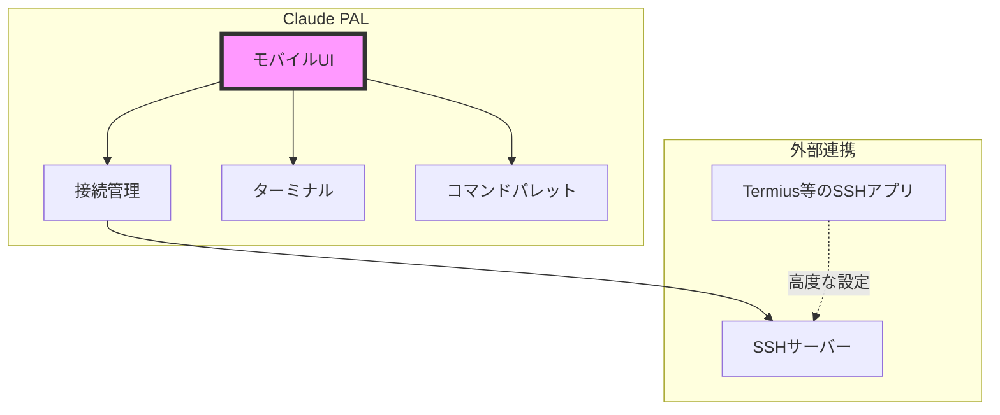

# Claude PAL - モバイル端末でClaude Codeを操作するためのUIアプリ

## コンセプト
"Claude Codeをスマホで快適に操作できるUI/UXに特化したアプリ"

## アプリの責任範囲

### ✅ Claude PALが提供すること
1. **Claude Code専用の最適化されたモバイルUI**
   - タッチ操作に最適化されたターミナル
   - コード編集用の専用インターフェース
   - よく使うコマンドへのクイックアクセス

2. **SSH接続情報の管理**
   - 接続先の保存（ホスト、ポート、ユーザー名）
   - 複数プロファイルの管理
   - 最後に使用した接続の記憶

3. **基本的なSSH機能**
   - パスワード/鍵認証
   - 接続の維持と再接続

### ❌ ユーザーに任せること
1. **高度なSSH設定**
   - ポートフォワーディング
   - プロキシ設定
   - VPN設定
   - 複雑な鍵管理（Termiusなどの専用アプリを推奨）

2. **ネットワーク設定**
   - VPN接続
   - Tailscaleなどのツール設定
   - ファイアウォール設定

## 実装方針

### Phase 1: バックエンド機能（優先）
SSH接続とターミナル機能の基本実装

### Phase 2: デモ用UI
動作確認とプロトタイプ用のシンプルなUI

### Phase 3: 本格的なUI/UX
Claude Code操作に最適化された洗練されたUI

## アーキテクチャ



## 基本的なSSH接続実装

### 1. 接続情報の管理
```typescript
export interface ConnectionProfile {
  id: string;
  name: string;
  host: string;
  port: number;
  username: string;
  authType: 'password' | 'key';
  // 鍵ファイルのパスまたは内容（オプション）
  privateKey?: string;
}

export class ConnectionService {
  private profiles: ConnectionProfile[] = [];
  
  async saveProfile(profile: ConnectionProfile) {
    // Ionic Storageに保存
    await this.storage.set(`profile_${profile.id}`, profile);
  }
  
  async loadProfiles(): Promise<ConnectionProfile[]> {
    // 保存済みプロファイルを読み込み
    return this.profiles;
  }
  
  async getLastUsedProfile(): Promise<ConnectionProfile | null> {
    const lastId = await this.storage.get('last_used_profile');
    if (lastId) {
      return await this.storage.get(`profile_${lastId}`);
    }
    return null;
  }
}
```

### 2. SSH接続の基本実装
```typescript
export class SSHService {
  private connection: any = null;
  
  async connect(profile: ConnectionProfile) {
    const config = {
      host: profile.host,
      port: profile.port,
      username: profile.username,
      // 認証方法に応じて設定
      ...(profile.authType === 'password' ? {
        password: await this.promptPassword()
      } : {
        privateKey: profile.privateKey
      })
    };
    
    // SSH2ライブラリを使用して接続
    this.connection = await this.establishConnection(config);
    
    // ターミナルセッションを開始
    return this.connection.shell();
  }
  
  async disconnect() {
    if (this.connection) {
      this.connection.end();
      this.connection = null;
    }
  }
}
```

### 3. デモ用UI（Phase 2）
```typescript
@Component({
  selector: 'app-connection',
  template: `
    <ion-header>
      <ion-toolbar>
        <ion-title>SSH接続</ion-title>
      </ion-toolbar>
    </ion-header>
    
    <ion-content>
      <!-- シンプルな接続フォーム -->
      <ion-list>
        <ion-item>
          <ion-label position="floating">ホスト</ion-label>
          <ion-input [(ngModel)]="connection.host"></ion-input>
        </ion-item>
        
        <ion-item>
          <ion-label position="floating">ポート</ion-label>
          <ion-input [(ngModel)]="connection.port" type="number" value="22"></ion-input>
        </ion-item>
        
        <ion-item>
          <ion-label position="floating">ユーザー名</ion-label>
          <ion-input [(ngModel)]="connection.username"></ion-input>
        </ion-item>
        
        <ion-item>
          <ion-label>認証方法</ion-label>
          <ion-select [(ngModel)]="connection.authType">
            <ion-select-option value="password">パスワード</ion-select-option>
            <ion-select-option value="key">SSH鍵</ion-select-option>
          </ion-select>
        </ion-item>
        
        <ion-item *ngIf="connection.authType === 'key'">
          <ion-label position="floating">SSH秘密鍵</ion-label>
          <ion-textarea [(ngModel)]="connection.privateKey" rows="5"></ion-textarea>
        </ion-item>
      </ion-list>
      
      <ion-button expand="block" (click)="connect()">接続</ion-button>
      
      <!-- 保存済みプロファイル -->
      <ion-list *ngIf="profiles.length > 0">
        <ion-list-header>保存済み接続</ion-list-header>
        <ion-item *ngFor="let profile of profiles" (click)="loadProfile(profile)">
          <ion-label>
            <h2>{{ profile.name }}</h2>
            <p>{{ profile.username }}@{{ profile.host }}:{{ profile.port }}</p>
          </ion-label>
        </ion-item>
      </ion-list>
    </ion-content>
  `
})
export class ConnectionPage {
  connection = {
    host: '',
    port: 22,
    username: '',
    authType: 'password',
    privateKey: ''
  };
  
  profiles: ConnectionProfile[] = [];
  
  async connect() {
    try {
      await this.sshService.connect(this.connection);
      await this.router.navigate(['/terminal']);
    } catch (error) {
      await this.showError('接続エラー: ' + error.message);
    }
  }
}
```

### 4. Claude Code専用UI機能（Phase 3で実装）
```typescript
// クイックコマンド機能
export interface QuickCommand {
  label: string;
  command: string;
  icon?: string;
}

const CLAUDE_CODE_COMMANDS: QuickCommand[] = [
  { label: 'ファイル一覧', command: 'ls -la', icon: 'list' },
  { label: 'ディレクトリ移動', command: 'cd ', icon: 'folder' },
  { label: 'ファイル編集', command: 'nano ', icon: 'create' },
  { label: 'Git Status', command: 'git status', icon: 'git-branch' },
  { label: 'Git Pull', command: 'git pull', icon: 'cloud-download' },
  { label: 'Git Commit', command: 'git commit -m ""', icon: 'checkmark' },
  { label: 'プロセス確認', command: 'ps aux | grep', icon: 'analytics' },
  { label: 'ログ確認', command: 'tail -f ', icon: 'document-text' }
];

// ジェスチャー操作
export class GestureHandler {
  setupGestures(terminalElement: HTMLElement) {
    // スワイプでコマンドパレット表示
    const gesture = createGesture({
      el: terminalElement,
      gestureName: 'swipe-up',
      onMove: (ev) => this.handleSwipe(ev),
      onEnd: () => this.showCommandPalette()
    });
    
    gesture.enable();
  }
}
```

## 実装ロードマップ

### Phase 1: バックエンド機能（1週間）優先実装
- [ ] SSH接続サービスの基本実装
- [ ] ターミナルエミュレーターの統合
- [ ] 接続プロファイルの保存機能
- [ ] 基本的な認証（パスワード/鍵）

### Phase 2: デモ用UI（3日）
- [ ] シンプルな接続画面
- [ ] 基本的なターミナル画面
- [ ] 最低限の設定画面

### Phase 3: 本格的なUI/UX（2週間）
- [ ] Claude Code専用のコマンドパレット
- [ ] タッチ操作に最適化されたUI
- [ ] ジェスチャー操作
- [ ] テーマとカスタマイズ
- [ ] 高度なターミナル機能

## 外部アプリとの連携

### Termiusなどとの使い分け
```
Claude PAL：
- Claude Code操作に特化
- シンプルな接続
- 専用UI/UX

Termius等：
- 高度なSSH機能
- 複雑な鍵管理
- ポートフォワーディング
```

### 連携例
1. 複雑な設定はTermiusで行う
2. 日常的なClaude Code操作はClaude PALで
3. 必要に応じて両方を併用

## まとめ

このアプローチにより：
- **開発がシンプル**: 基本的なSSH機能のみに集中
- **UXに注力**: Claude Code専用の最適化に時間を使える
- **段階的実装**: バックエンド→デモUI→本格UIの順で確実に進められる
- **実用的**: ユーザーは既存のSSHツールと併用可能