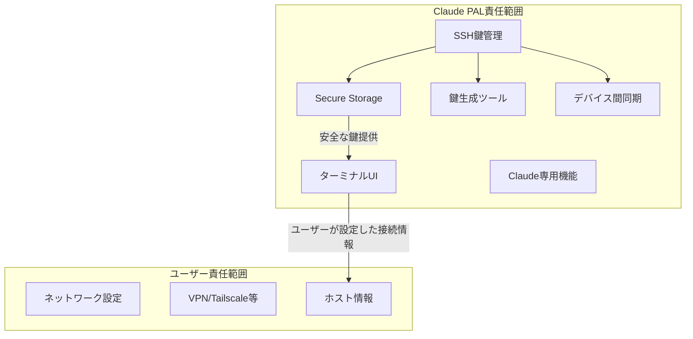

# SSH鍵管理に特化したClaude PALアーキテクチャ

## コンセプト
"SSH鍵の安全な管理に特化し、接続設定はユーザーの自由に"

## アプリの責任範囲

### ✅ Claude PALが管理すること
1. **SSH鍵の安全な保存**
2. **SSH鍵の生成補助**
3. **美しいターミナルUI**
4. **Claude Code用の最適化されたUX**

### ❌ ユーザーに任せること
1. **ネットワーク設定**（VPN、ポート転送など）
2. **接続方法の選択**（Tailscale、Cloudflareなど）
3. **IPアドレス/ホスト名の管理**

## 実装アーキテクチャ



## SSH鍵管理の実装

### 1. 鍵の安全な保存（iOS）
```typescript
import { Capacitor } from '@capacitor/core';
import { SecureStoragePlugin } from 'capacitor-secure-storage-plugin';
import CryptoJS from 'crypto-js';

export class SSHKeyManager {
  private readonly keyPrefix = 'ssh_key_';
  
  async savePrivateKey(keyName: string, privateKey: string, passphrase?: string) {
    if (Capacitor.getPlatform() === 'ios') {
      // iOS: Keychainに保存（Touch ID/Face IDで保護）
      await SecureStoragePlugin.set({
        key: `${this.keyPrefix}${keyName}`,
        value: privateKey,
        options: {
          accessible: 'WhenUnlockedThisDeviceOnly',
          group: 'com.claudepal.app',
          synchronizable: false,
          authenticationPrompt: 'SSH鍵へのアクセスを許可'
        }
      });
    } else if (Capacitor.getPlatform() === 'android') {
      // Android: Android Keystore使用
      await this.saveToAndroidKeystore(keyName, privateKey);
    } else {
      // Web: 暗号化してLocalStorageに保存（開発用）
      const encrypted = CryptoJS.AES.encrypt(privateKey, passphrase || '').toString();
      localStorage.setItem(`${this.keyPrefix}${keyName}`, encrypted);
    }
  }
  
  async getPrivateKey(keyName: string): Promise<string> {
    // 生体認証でアンロック
    const biometricResult = await this.authenticateBiometric();
    if (!biometricResult.success) {
      throw new Error('認証に失敗しました');
    }
    
    // プラットフォーム別に取得
    return await this.retrieveKey(keyName);
  }
}
```

### 2. SSH鍵生成機能
```typescript
import { generateKeyPair } from 'crypto';

export class SSHKeyGenerator {
  async generateNewKeyPair(options: KeyGenOptions) {
    return new Promise<KeyPair>((resolve, reject) => {
      generateKeyPair('rsa', {
        modulusLength: options.bits || 4096,
        publicKeyEncoding: {
          type: 'spki',
          format: 'pem'
        },
        privateKeyEncoding: {
          type: 'pkcs1',
          format: 'pem',
          cipher: options.passphrase ? 'aes-256-cbc' : undefined,
          passphrase: options.passphrase
        }
      }, (err, publicKey, privateKey) => {
        if (err) reject(err);
        else resolve({ publicKey, privateKey });
      });
    });
  }
  
  formatForSSH(publicKey: string): string {
    // OpenSSH形式に変換
    // ssh-rsa AAAAB3NzaC1yc2... user@claudepal
    return this.convertToOpenSSHFormat(publicKey);
  }
}
```

### 3. ユーザーインターフェース
```typescript
@Component({
  selector: 'app-connection',
  template: `
    <ion-header>
      <ion-toolbar>
        <ion-title>接続設定</ion-title>
      </ion-toolbar>
    </ion-header>
    
    <ion-content>
      <!-- SSH鍵管理セクション -->
      <ion-card>
        <ion-card-header>
          <ion-card-title>SSH鍵（アプリが管理）</ion-card-title>
        </ion-card-header>
        <ion-card-content>
          <ion-list>
            <ion-item *ngFor="let key of sshKeys">
              <ion-label>
                <h2>{{ key.name }}</h2>
                <p>{{ key.fingerprint }}</p>
              </ion-label>
              <ion-button slot="end" (click)="copyPublicKey(key)">
                <ion-icon name="copy"></ion-icon>
              </ion-button>
            </ion-item>
          </ion-list>
          
          <ion-button expand="block" (click)="generateNewKey()">
            <ion-icon name="add" slot="start"></ion-icon>
            新しい鍵を生成
          </ion-button>
        </ion-card-content>
      </ion-card>
      
      <!-- 接続情報セクション -->
      <ion-card>
        <ion-card-header>
          <ion-card-title>接続先（ユーザーが設定）</ion-card-title>
        </ion-card-header>
        <ion-card-content>
          <ion-item>
            <ion-label position="floating">ホスト名/IPアドレス</ion-label>
            <ion-input 
              [(ngModel)]="connection.host" 
              placeholder="例: 192.168.1.100, mac.local, my-mac.tailscale">
            </ion-input>
          </ion-item>
          
          <ion-item>
            <ion-label position="floating">ポート</ion-label>
            <ion-input 
              [(ngModel)]="connection.port" 
              type="number" 
              value="22">
            </ion-input>
          </ion-item>
          
          <ion-item>
            <ion-label position="floating">ユーザー名</ion-label>
            <ion-input [(ngModel)]="connection.username"></ion-input>
          </ion-item>
          
          <ion-item>
            <ion-label>SSH鍵を選択</ion-label>
            <ion-select [(ngModel)]="connection.keyName">
              <ion-select-option *ngFor="let key of sshKeys" [value]="key.name">
                {{ key.name }}
              </ion-select-option>
            </ion-select>
          </ion-item>
          
          <ion-note>
            <p>接続方法の例：</p>
            <ul>
              <li>同一WiFi: 192.168.1.100 または mac.local</li>
              <li>Tailscale使用時: my-mac.tailscale</li>
              <li>ポート転送時: my-domain.com:2222</li>
            </ul>
          </ion-note>
        </ion-card-content>
      </ion-card>
      
      <ion-button expand="block" (click)="connect()" [disabled]="!canConnect()">
        接続
      </ion-button>
    </ion-content>
  `
})
export class ConnectionPage {
  sshKeys: SSHKey[] = [];
  connection = {
    host: '',
    port: 22,
    username: '',
    keyName: ''
  };
  
  async generateNewKey() {
    const alert = await this.alertController.create({
      header: '新しいSSH鍵を生成',
      inputs: [
        {
          name: 'keyName',
          type: 'text',
          placeholder: '鍵の名前（例: Claude PAL Key）'
        },
        {
          name: 'passphrase',
          type: 'password',
          placeholder: 'パスフレーズ（オプション）'
        }
      ],
      buttons: [
        { text: 'キャンセル', role: 'cancel' },
        {
          text: '生成',
          handler: async (data) => {
            const keyPair = await this.keyGenerator.generateNewKeyPair({
              bits: 4096,
              passphrase: data.passphrase
            });
            
            await this.keyManager.savePrivateKey(
              data.keyName,
              keyPair.privateKey,
              data.passphrase
            );
            
            // 公開鍵をクリップボードにコピー
            await Clipboard.write({
              string: this.keyGenerator.formatForSSH(keyPair.publicKey)
            });
            
            await this.showToast('SSH鍵を生成しました。公開鍵をコピーしました。');
            await this.loadKeys();
          }
        }
      ]
    });
    
    await alert.present();
  }
  
  async copyPublicKey(key: SSHKey) {
    const publicKey = await this.keyManager.getPublicKey(key.name);
    await Clipboard.write({ string: publicKey });
    await this.showToast('公開鍵をコピーしました');
  }
  
  async connect() {
    try {
      // SSH鍵を安全に取得（生体認証）
      const privateKey = await this.keyManager.getPrivateKey(this.connection.keyName);
      
      // 接続を試行
      await this.sshService.connect({
        host: this.connection.host,
        port: this.connection.port,
        username: this.connection.username,
        privateKey: privateKey
      });
      
      // 接続成功したら設定を保存
      await this.saveConnectionPreference();
      
      // ターミナル画面へ遷移
      await this.router.navigate(['/terminal']);
    } catch (error) {
      await this.showError('接続に失敗しました: ' + error.message);
    }
  }
}
```

### 4. セットアップガイド
```typescript
@Component({
  template: `
    <ion-slides>
      <ion-slide>
        <h2>ステップ1: SSH鍵の生成</h2>
        <p>アプリ内で安全なSSH鍵を生成します</p>
        <ion-button (click)="generateKey()">鍵を生成</ion-button>
      </ion-slide>
      
      <ion-slide>
        <h2>ステップ2: 公開鍵の登録</h2>
        <p>生成された公開鍵をMacに登録してください</p>
        <code>{{ publicKey }}</code>
        <ion-button (click)="copyPublicKey()">コピー</ion-button>
        <p class="instructions">
          Macのターミナルで実行:<br>
          echo "{{ publicKey }}" >> ~/.ssh/authorized_keys
        </p>
      </ion-slide>
      
      <ion-slide>
        <h2>ステップ3: 接続方法の選択</h2>
        <p>お好みの方法でMacにアクセスできるようにしてください</p>
        <ion-list>
          <ion-item>
            <ion-label>
              <h3>同一WiFi内</h3>
              <p>設定不要。MacのIPアドレスを使用</p>
            </ion-label>
          </ion-item>
          <ion-item>
            <ion-label>
              <h3>Tailscale（推奨）</h3>
              <p>簡単で安全な外部アクセス</p>
            </ion-label>
          </ion-item>
          <ion-item>
            <ion-label>
              <h3>その他</h3>
              <p>お好みのVPNやトンネリングツール</p>
            </ion-label>
          </ion-item>
        </ion-list>
      </ion-slide>
    </ion-slides>
  `
})
export class SetupGuidePage {}
```

## メリット

### 開発側
1. **責任範囲が明確**: SSH鍵管理のみに集中
2. **実装がシンプル**: ネットワーク設定の複雑さを回避
3. **セキュリティ**: 鍵管理に特化して高セキュリティを実現

### ユーザー側
1. **柔軟性**: 好きな接続方法を選べる
2. **既存環境の活用**: すでに設定済みのVPN等を使える
3. **安心感**: 鍵は安全にアプリが管理

## 実装ロードマップ

### Phase 1: コア機能（2週間）
- [ ] SSH鍵の生成
- [ ] Secure Storageへの保存
- [ ] 基本的な接続機能

### Phase 2: UI/UX（2週間）
- [ ] 美しいターミナルUI
- [ ] Claude Code専用の最適化
- [ ] ジェスチャー操作

### Phase 3: 便利機能（2週間）
- [ ] 複数の鍵管理
- [ ] 接続プロファイル保存
- [ ] セットアップウィザード

## まとめ

この方法なら：
- **ネットワーク設定の責任を負わない**
- **SSH鍵管理で明確な価値を提供**
- **実装がシンプルで保守しやすい**
- **ユーザーの自由度が高い**

完璧なバランスの取れたアプローチです！